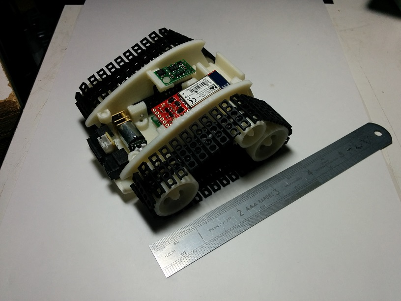

uCee
====

Micro Crawler robot code repository.

Micro Crawler (or uCee) is a small robot I'm building to experiment with more powerful microcontrollers in a robot.

Eventually, I plan to use a MicroPython board as the main processor, but until that becomes available I'm using a Teensy 3.1.

uCee is small and fairly powerful - it has a 9-axis IMU, a bluetooth module, optical encoders on the gearmotors, full PWM control of the gearmotors, and paired GP2Y0A41SK0F/ProxDot IR sensors on the front and each side. Please see http://blog.huv.com for more pictures and details.

