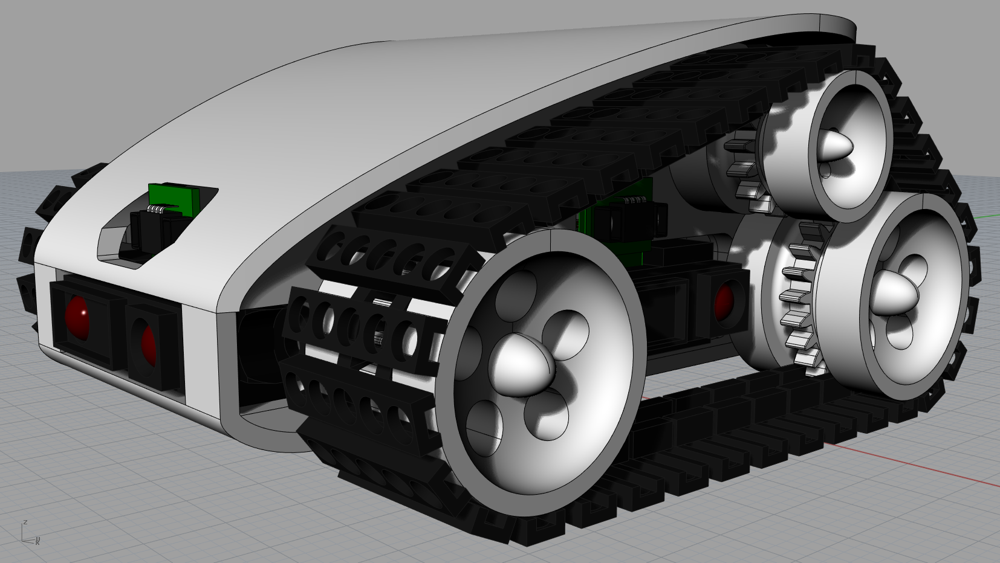

uCee CAD Model

This folder contains the CAD model (zipped) for the robot, as well as STL files for the individual pieces.

The CAD model was developed using Rhino. If you would like an export of the model in some other format, please ask.

