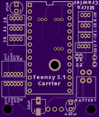
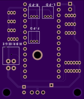

uCee PCB

This PCB (which is a carrier board for the Teensy 3.1) was developed using Rimu PCB (http://www.hutson.co.nz/rimupcb.htm).

The ZIP file contains what is needed to have the board manufactured by OSH Park (http://oshpark.com/).

 == 
